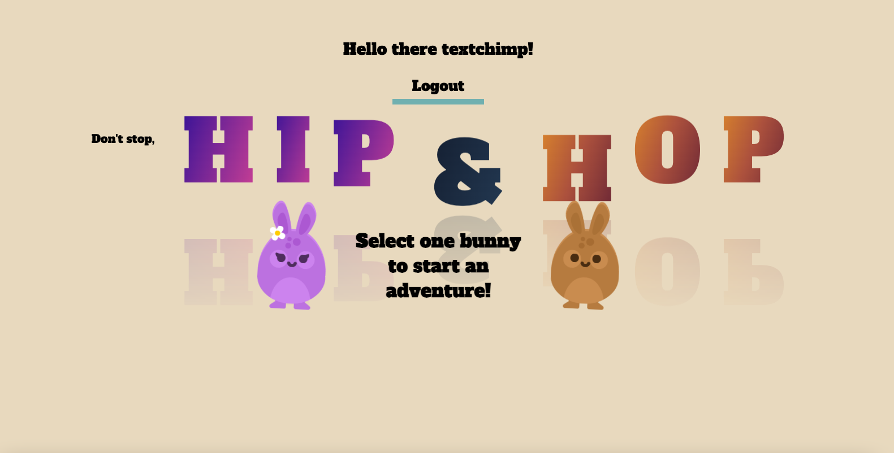

# Welcome to Hip & Hop!

Links to the game app: 

[hip&hop - frontend](https://hipandhop.netlify.app//)

[hip&hop - backend](https://hipandhop.herokuapp.com/)

### Overview of webpage





### Description:

## Hip Game


### Login Details
```
email: kris@ga.co
password: chicken

email: luke@ga.co
password: chicken


```


### Behind the Scenes
### Project Features:

### Tools Used:
> * MongoDB
> * Mongoose
> * Express JS
> * Phaser 3.55.2
> * Piskel 
> * JS
> * CSS
> * Netlify (Deployment)
> * Heroku (Deployment)

### Challenges:


### Lesson Learnt:


    


