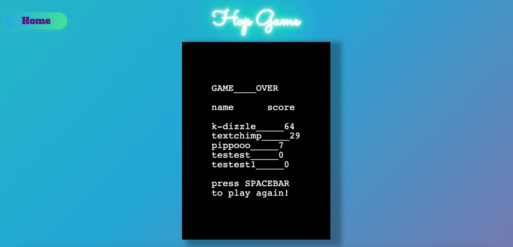

# Welcome to Hip & Hop!

Links to the game app: 

[hip&hop - frontend](https://hipandhop.netlify.app//)

[hip&hop - backend](https://hipandhop.herokuapp.com/)

### Overview of webpage

Hip and Hop is your friendly neighbourhood game and it is certified general (G) rated! Featuring two cute bunnies that are about to go for an adventure!

Each bunny will play a different game, have different collectibles and face different obstacles! Very suitable for all demographics and the gameplay is very straight forward.

The theme is that Hip (the purple bunny) will be travelling horizontally on ground, and Hop (the brown bunny) will be travelling vertically by climbing platforms

If you want to record your high scores and show it off, make sure to sign up / log in to our cute little game!

Detailed description of each game will be stated below. For now please enjoy some of the game snippets!




### Description:

## Hip Game


## Hop Game
### Instructions
Press the Up key to jump
Left and right key to walk the player left and right

### Gameplay
Control the hungry brown bunny and jump onto platforms to collect carrots! 

You will traverse various fun platforms of various sizes! Normal platforms, moving platforms, and icy slippery platforms. If you're not careful enough you will slip and fall to your demise!

And most importantly, avoid bombs. YES BOMBS. THERE ARE BOMBS IN THIS GAME. MUAHAHAHAHAHAHAHAHAH. :bomb:


### Login Details
```
email: kris@ga.co
password: chicken

email: luke@ga.co
password: chicken

```

### Project Features:
### Tools Used:
> * MongoDB
> * Mongoose
> * Express JS
> * Phaser 3.55.2
> * Piskel 
> * JS
> * CSS
> * Netlify (Deployment)
> * Heroku (Deployment)

## Challenges / Lesson Learnt:
### Learning and picking up a new library
> * We were encouraged to pick up a new library called Phaser when we have decided to make a game for our final project in a week. We used this opportunity to exercise our skills on picking up a new tool/library/framework which is very applicable and common in workplaces. Throughout we did extensive RTFM and STFW on how the library works and use what we learnt to build a project.

> * MongoDB and mongoose is a fairly new tech stack we learnt in a few days and we wanted to practice it by implementing user login / sign up, so that user can store their high scores at the database.

> * Throughout making the game we exercise a lot on logic thinking and understanding how games were written behind the scenes. We learnt new concepts about gaming logic such as physics, cause / effect, problem solving skills etc which contributes tremendously to our coding skills.

> * Initially we wanted to use React as our frontend framework for this project, however we were faced with a problem that we can't show two games on a different route in React. We managed to get a single game shown on the main page of React, however we have two games and there's a conflict in how React and Phaser reads the DOM. We learnt that React was not designed to render real time games (especially if you have multiple games). 

> * Practiced more on merging conflicts and git branches


    


